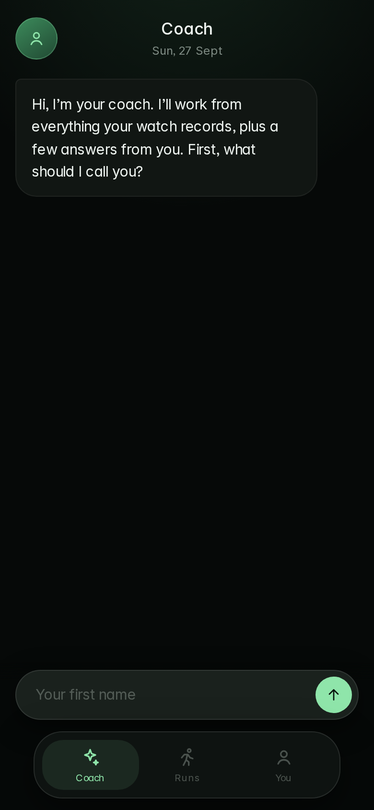
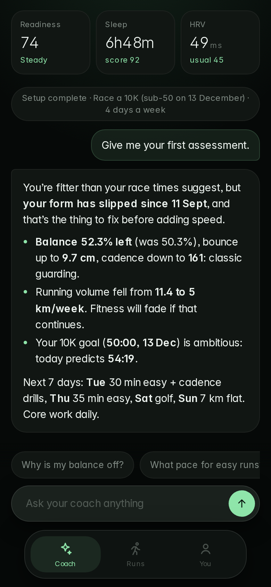
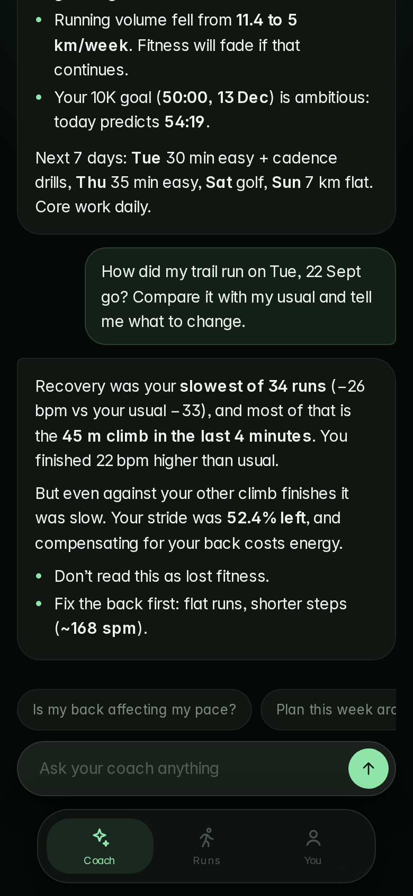
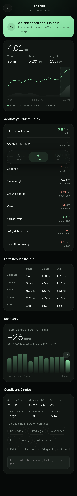

# Meridian

A personal running coach that knows everything your **Huawei Watch GT 6 Pro** records. You talk to it. It looks up whatever it needs in your data *at that moment*, then decides what you should do.

| Coach setup | First assessment | Asking about a run | A run's data |
|---|---|---|---|
|  |  |  |  |

*Screenshots use scripted coach replies. Live answers are generated from your data.*

## How it works

```
You ask ──▶ Coach (Claude) ──decides what to look up──▶ Tools (Meridian's analysis code)
                ▲                                              │
                └──────── facts: numbers, dates, comparisons ◀─┘
```

- **The coach reasons, the code calculates.** The analysis engine (baselines, run comparisons, recovery, form trends, VDOT paces, periodised plans) is exposed to the coach as tools. Every number in an answer was computed from your data for that question, never remembered or made up.
- **Nothing is canned.** There are no pre-written insight cards. Opening the app gives you a fresh briefing for the day (once a day, and again after new data syncs). Every answer ends with three suggested follow-ups generated for that conversation.
- **It learns you.** Setup is a short chat (13 questions): age and sex for heart-rate zones and peer norms, your goal and race, experience, days available, long-run day, injuries, other sports, and how you want to be coached (tone and detail). The coach reads this before every answer. It can also save goals, log symptoms and remember durable facts as you talk.

### The coach's tools

| Tool | What it computes |
|---|---|
| `get_today` | Readiness and its drivers (HRV and resting HR vs your 60-day baseline, sleep, sleep debt, load), last night's sleep, training load, strain alert, latest run |
| `get_daily_metrics` | Day-by-day sleep, HRV, resting HR, steps, stress, SpO₂, weight |
| `list_runs` / `analyse_run` | Every run with form data; one run against your last 10, form by thirds, HR drift, 1-min recovery ranked and explained (e.g. a climb at the end), pre-run context, next-morning HRV, per-minute series |
| `running_form_trend` | Balance, vertical oscillation, cadence, ground contact and vertical ratio: last 3 runs vs the 6 before |
| `check_symptom` | For "sore back", "tight calves" and so on: the matching changes in your form, load, terrain and sleep, plus red flags. Logs it so plans adapt |
| `training_plan` / `set_goal` | VDOT from watch VO₂ max and your runs, race predictions, goal feasibility, paces and HR ranges, base → build → peak → taper, and this week's sessions adapted to readiness and symptoms |
| `compare_to_peers` | Percentiles vs your age and sex, and fitness age |
| `personal_patterns` | Statistically tested cause-and-effect in your own data |
| `remember` | Saves durable facts (injury history, schedule, race entries) |

### The app

Five tabs of dashboards, plus the coach:

| Today | Sleep | Heart | Training | Insights |
|---|---|---|---|---|
| Readiness with 14-day chart, HRV and resting HR tiles, today's focus, vitals, a discovered pattern | Hypnogram, stages, tonight's lights-out time, debt, regularity, 14 nights | HRV and resting HR against your normal range, intraday heart rate, ECG and other checks | **Overview** (VO₂ max, load, 80/20, volume) · **Runs** (body check-in, form trend, every run with full analysis) · **Plan** (goal, predictions, this week, paces) | Weekly review, you vs peers, patterns, experiments |

**Coach** is one section: the round **Coach** button on every screen, and **Ask the coach** buttons on each run, each body check-in and in Insights, which carry that context into the conversation. Its first visit runs the setup questions. Coach settings (passcode, remembered facts, redo setup, clear conversation) are in the profile sheet.

## Two ways to run the coach

| | **On your Claude plan** (no API key) | **On your own server** (API key) |
|---|---|---|
| Where | A private claude.ai Artifact, opened in the Claude app or claude.ai | Any Node host (`render.yaml` included) |
| Who pays | Your existing Claude subscription's usage | Anthropic API billing (~$0.10–0.30 a question) |
| Watch data | Demo data for now (Artifacts can't reach Huawei's servers) | Live Huawei Health Kit sync |
| Setup | Nothing: open the link and allow Claude access once | Deploy, add key and passcode |

Both use the same prompt (`public/js/coach/prompt.js`) and the same tools (`public/js/coach/tools.js`). In the Artifact, the tools run in the page and Claude is reached through claude.ai's `sample` capability (`public/js/coach/local.js`). On the server, `server/coach.js` runs the same tools and calls the Anthropic API. The Artifact entry page is `public/artifact.html`.

## Running it

```bash
cd meridian
npm install
ANTHROPIC_API_KEY=sk-ant-... npm start     # → http://localhost:5173
npm test                                   # engine, tools and coach-loop tests
```

Without an API key everything except the coach works, and the Coach tab says so.

### Put it on your phone

The coach needs a server, so the GitHub Pages copy can show your data but can't answer questions. To deploy the real thing:

1. At [render.com](https://render.com), choose **New → Blueprint** and pick this repository. It uses `render.yaml` in the repo root.
2. When asked, enter `ANTHROPIC_API_KEY` (from console.anthropic.com) and a `MERIDIAN_PASSCODE` of your choice.
3. Open the Render URL in Chrome on your phone, then go to **⋮ → Add to Home screen**. Enter your passcode under **You**.

The passcode stops anyone who finds the URL from spending your API credits. There's also a limit of 40 questions per 10 minutes per device.

### Cost

The coach uses `claude-opus-5`. A typical question runs 2–3 tool rounds, costing roughly **$0.10–0.30**. A daily briefing plus a few questions a day comes to about **$10–25 a month**. The prompt and tools are cached between rounds to keep this down. For lower cost, change `MODEL` in `server/coach.js` to `claude-sonnet-5`, at some loss of reasoning quality.

## Connecting Strava (quickest way to get your real runs in)

Huawei Health can send every workout to Strava automatically, and Strava's API is free for personal apps with no approval wait.

1. **In Huawei Health on your phone:** Me → Data sharing and authorisation → Strava → connect. Your watch workouts now appear in Strava.
2. **Create a Strava API app** at [strava.com/settings/api](https://www.strava.com/settings/api). Use any name, set **Authorization Callback Domain** to your server's domain (e.g. `meridian.onrender.com`, or `localhost` for testing), and copy the **Client ID** and **Client Secret**.
3. **Put them on the server** as `STRAVA_CLIENT_ID` and `STRAVA_CLIENT_SECRET` (Render asks for them; `render.yaml` lists them).
4. **In Meridian:** Training → Runs → **Connect with Strava**, then approve.

The first sync brings in 120 days of activities and second-by-second heart rate, pace, altitude and cadence for up to 60 recent runs and walks. These are cached, so later syncs only fetch what's new. The app re-syncs in the background when data is over an hour old, and there's a **Sync** button. Strava's workouts replace the demo ones in Training, the run pages, recovery, the plan and the coach. Strava has no sleep, HRV or running-form data (oscillation, contact time, balance), so those keep coming from the demo data until Huawei Health Kit is connected.

## Connecting your GT 6 Pro

```
GT 6 Pro ──Bluetooth──▶ Huawei Health app ──▶ Huawei cloud ──Health Kit REST API──▶ Meridian server
```

1. Create a developer account at [developer.huawei.com](https://developer.huawei.com). In AppGallery Connect, create a project and web app and enable **Health Kit**.
2. Apply for the read scopes (steps, heart rate, sleep, stress, SpO₂, weight, activity records). Huawei reviews these, and approval can take days.
3. Add `https://YOUR-URL/api/huawei/callback` as the redirect URI, and set `HUAWEI_CLIENT_ID` and `HUAWEI_CLIENT_SECRET` on the server.
4. In the app, go to **You → Connect Huawei Health**.

The field mapping is in `server/huawei.js` and hasn't been tested against a live account. Use `/api/huawei/raw?kind=sleep` (or `activity`, `steps`, `hrv`, …) to see Huawei's raw responses and adjust. Running form (cadence, stride, ground contact, vertical oscillation) comes from the watch; left/right balance usually needs a foot pod or chest strap. Anything missing is simply left out of the analysis.

Until you connect, the app runs on demo data built around your real readings from 27 Sept.

## Layout

```
meridian/
├── server/
│   ├── index.js      static files, Huawei OAuth, /api/coach (passcode + rate limit)
│   ├── coach.js      the coach: system prompt, streaming tool loop, follow-ups
│   ├── tools.js      the coach's tools, wrapping the analysis engine
│   └── huawei.js     Health Kit connection and data mapping
├── public/           installable web app, no build step
│   ├── js/app.js         Coach / Runs / You
│   ├── js/ui/            onboarding questions, safe reply formatting, charts, icons
│   ├── js/analysis/      the engine: readiness, sleep, training, runs, body, plan, norms
│   └── js/data/          demo data (daily + per-run detail), schema, storage
└── test/             engine, tools and coach-loop tests (the loop runs against a scripted client)
```

Privacy: your chat, profile and notes stay on your phone. Each question sends your profile and a question to your server. The server reads your watch data and sends the relevant facts to Anthropic's API to produce the answer.

*Meridian is not a medical device. It flags warning signs, but it doesn't diagnose. See a doctor or physio about pain that's severe, persistent or comes with the red flags the coach lists.*
