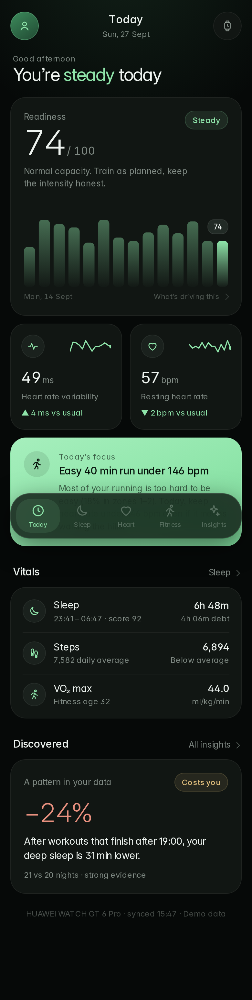
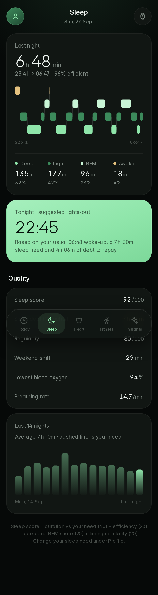
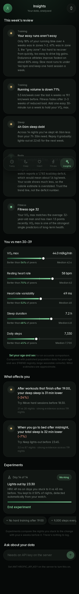
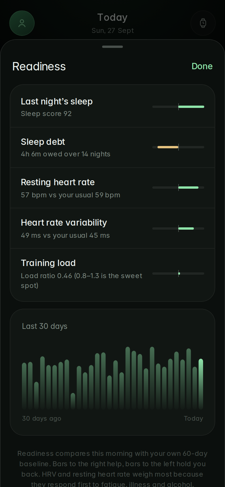

# Meridian

A companion app for the **Huawei Watch GT 6 Pro**. It takes the data the watch already collects and turns it into a few clear decisions a day. It doesn't show you another wall of numbers.

| Today | Sleep | Insights | Readiness |
|---|---|---|---|
|  |  |  |  |

## Design principles

- **One answer first.** Each screen leads with a single decision: readiness, tonight's bedtime, or this week's biggest issue. The detail sits one tap away in a sheet.
- **You vs. you, then you vs. peers.** HRV and resting heart rate are judged against *your* 60-day normal range. Population comparisons live on their own page and are clearly labelled as approximate.
- **Critical, not cheerleading.** The weekly review ranks problems before praise and explains the fix.
- **Only claims the data can back.** Personal patterns are shown only when they pass a significance test with enough nights on both sides.
- **Deep green theme.** Near-black with a green cast, one mint accent, light type weights (Inter, bundled so it works offline), hairline borders, gradient bar charts, circular icon badges and a floating tab bar. Colour only appears where it carries meaning, such as a warning. Reduced-motion is respected.

## What it does that the Huawei Health app doesn't

| Feature | What it is |
|---|---|
| **Readiness score** | Last night's HRV and resting HR against your own baseline, plus sleep, sleep debt and training load. The drivers are shown so you can see *why*. |
| **Today's focus** | One concrete instruction, for example "Easy 40 min run under 146 bpm" or "Quality session: 5 × 4 min", chosen from readiness and training state. |
| **Early strain signal** | Flags HRV suppressed together with RHR elevated for 2+ mornings, which often comes before illness or overreaching. |
| **Personal patterns** | Tests your habits (late workouts, late bedtimes, active days, stressful days) against your sleep and recovery, for example *"After workouts that finish after 19:00, your deep sleep is 28 min lower (−21%)"*. |
| **Experiments** | Start a 14-day experiment such as "Lights out by 23:30". Whether you stuck to it is detected automatically from the watch, so there's nothing to log, and the result is compared with your previous 4 weeks. |
| **Peer comparison** | Percentiles for VO₂ max, RHR, HRV, sleep and steps against people of your age and sex, plus **fitness age**. |
| **Training load** | Heart-rate-weighted load (Banister TRIMP), a 7-day vs 28-day load ratio with sweet-spot guidance, and aerobic efficiency. |
| **80/20 intensity check** | Shows how much of your running is really easy. Your demo data is 18% easy, which is the most common amateur mistake. |
| **Sleep coaching** | 14-night sleep debt, a regularity score, weekend "social jet lag", and a suggested lights-out time for tonight. |
| **Honest weight trend** | A smoothed trend line instead of daily noise. It also checks the watch's calorie "deficit" against what the scale actually did. |
| **Plain-English heart checks** | ECG, arrhythmia screening and arterial stiffness results explained, with sensible next steps. |
| **Ask about your data** | Optional. Ask questions in plain language, for example *"why was my deep sleep low on Tuesday?"*, answered by Claude using your last 30 days. |

## Run it

```bash
cd meridian
npm install
npm start            # → http://localhost:5173
npm test             # analysis engine tests
```

It opens with demo data built around your real readings from 27 September (sleep 23:41→06:47, 6,894 steps, SpO₂ 94–99%, 88.9 kg, your September runs), so everything works before you connect anything.

**Put it on your phone:** deploy the `meridian/` folder to any Node host (Railway, Render, Fly.io, or a Raspberry Pi at home). Open the URL in Chrome on your phone, then go to **⋮ → Add to Home screen**. It installs like an app, full screen and offline-capable.

Tap your avatar on the Today screen to set your **age, sex, height and sleep need**. The peer comparisons, heart rate zones and fitness age all depend on them. The demo assumes a 35-year-old man until you change it.

## Connecting your GT 6 Pro

The watch doesn't offer a public API that other phone apps can read directly. Its data flows like this:

```
GT 6 Pro ──Bluetooth──▶ Huawei Health app ──▶ Huawei cloud ──Health Kit REST API──▶ Meridian server
```

So the supported route is **Huawei Health Kit**:

1. Create a free developer account at [developer.huawei.com](https://developer.huawei.com).
2. In **AppGallery Connect**, create a project and a web app, then enable **Health Kit**.
3. Apply for the read permissions: steps, heart rate, sleep, stress, SpO₂, body weight, activity records. Huawei reviews these, and approval can take a few days.
4. Add `https://YOUR-DOMAIN/api/huawei/callback` as the OAuth redirect URI.
5. Start the server with your credentials:
   ```bash
   HUAWEI_CLIENT_ID=... HUAWEI_CLIENT_SECRET=... BASE_URL=https://YOUR-DOMAIN npm start
   ```
6. In the app, go to **avatar → Connect Huawei Health**, sign in with your Huawei ID and approve. In the Huawei Health app on your phone, make sure data sharing / cloud sync is switched on.

The endpoint paths, scopes and data-type names are all in `server/huawei.js` (the `HK` object). Huawei's field names can differ between API versions, so after connecting, open `/api/huawei/raw?kind=sleep` (also `steps`, `restingHr`, `hrv`, `activity`, …) to see the raw responses and adjust the mapping if anything is off. This connector hasn't been tested against a live account yet.

**Not everything is exposed by Health Kit.** ECG, arterial stiffness and skin temperature are currently app-only. Meridian shows them when they're present and simply hides those cards otherwise.

**Alternative: import a file.** Any JSON matching `public/js/data/schema.js` can be loaded from **avatar → Import data file**. Use this for exports or for data from another watch.

## Enabling "Ask about your data"

```bash
ANTHROPIC_API_KEY=sk-ant-... npm start
```

The browser sends a compact 30-day summary (no raw heart-rate streams) to your server, which asks Claude (`claude-opus-5`) and streams the answer back. Without a key the box is shown disabled.

## How it's built

```
meridian/
├── server/            zero-framework Node server
│   ├── index.js       static files + API routes
│   ├── huawei.js      Health Kit OAuth, sync and data mapping
│   └── ask.js         Claude-powered Q&A
├── public/            installable web app (no build step)
│   ├── js/analysis/   the engine: pure functions, shared with the tests
│   │   ├── norms.js       age/sex reference data (FRIEND registry VO₂ max, wearable cohorts)
│   │   ├── readiness.js   baseline z-scores → readiness + strain alert
│   │   ├── sleep.js       debt, regularity, social jet lag, score, bedtime
│   │   ├── training.js    TRIMP, load ratio, 80/20, efficiency
│   │   ├── discover.js    personal patterns (Welch t-test) + experiments
│   │   └── engine.js      focus, weekly review, peer comparison
│   ├── js/data/       demo data, schema, source selection
│   └── js/ui/         SVG charts + icons
└── test/
```

Privacy: your data stays on your own server. Huawei tokens are stored in `meridian/.data/` (git-ignored, file mode 600). Profile and experiments live in your browser's local storage.

*Meridian is not a medical device. Wrist-based VO₂ max, HRV and ECG are estimates. See a doctor about symptoms.*
